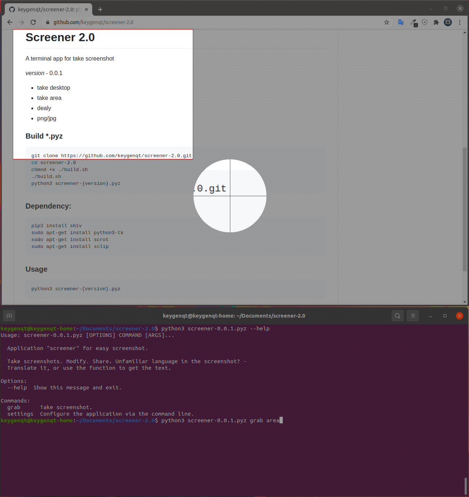

Screener 2.0
===================

A **CLI** app for take screenshot

**version** - 0.0.1

* take desktop
* take area
* dealy
* save in png/jpg
* set screenshot to clipboard
* upload to imgur
* update config yml from command line

### Build *.pyz

```shell
git clone https://github.com/keygenqt/screener-2.0.git
cd screener-2.0
chmod +x ./build.sh
./build.sh
```

### Dependency:

```shell
pip3 install shiv
sudo apt-get install python3-tk
sudo apt-get install scrot
sudo apt-get install xclip
```

### Usage

```shell
python3 screener-{version}.pyz
```

